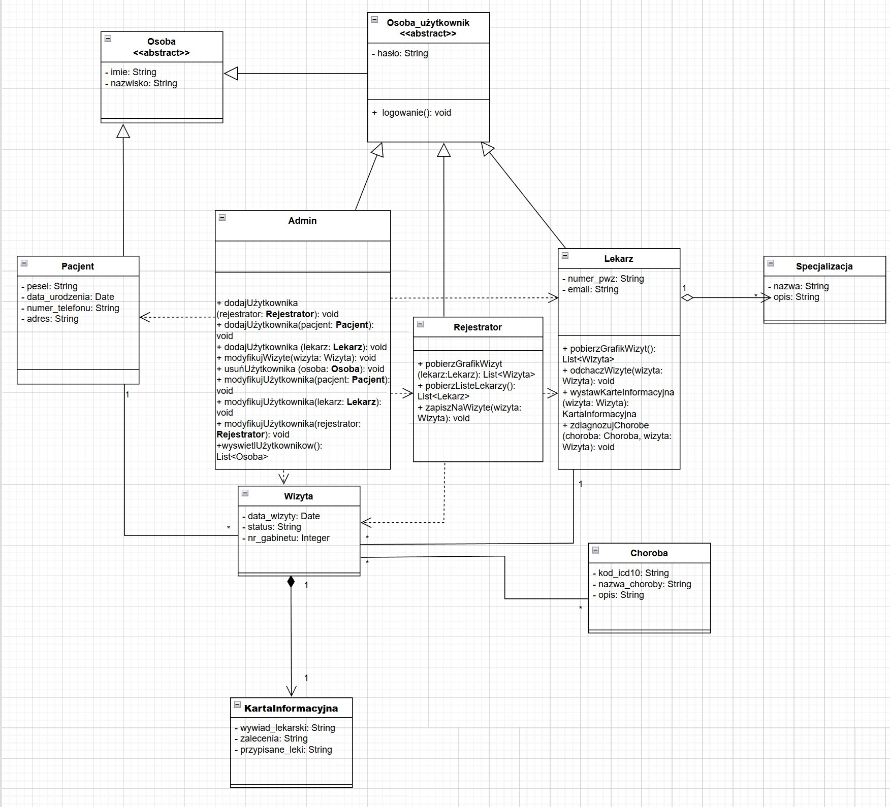

# Diagramy
---

## Struktura Plików
* **diagram klas** - `folder klas`

---

## Technikalia
Diagramy zostały wykonane z pomocą technologii: draw.io.

---

## Opis klas i zależności pomiędzy nimi

### Klasy abstrakcyjne
* **Osoba**: Klasa bazowa dla wszystkich użytkowników. Przechowuje dane logowania (hasło) oraz podstawowe dane identyfikacyjne. Udostępnia mechanizm logowania.
* **Osoba_klient**: Klasa bazowa dla podstawowych użytkowników. Dziedzy po klasie osoba. Posiada dodatkowe pole z listą wizyt oraz modół pozwalający odwołać wizyte.

### Klasy użytkowników
* **Admin**: Posiada najwyższe uprawnienia. Zarządza systemem poprzez dodawanie, modyfikację i usuwanie kont lekarzy i pacjentów, operując na abstrakcji Osoba_klient (dzięki polimorfizmowi). Może również ingerować w wizyty.
* **Lekarz**: Posiada przypisaną Specjalizację. Pobiera swój grafik wizyt, zmienia ich status (odhacza), odwołuje je oraz diagnozuje pacjentów: uzupełnia Kartę Informacyjną oraz choroby.
* **Rejestrator**: Pobiera listę lekarzy oraz ich grafiki, a także zapisuje pacjentów na wizyty.

### Klasy użytkowo-tablicowe
* **Karta Informacyjna**: Podczas wizyty lekarz generuje kartę z wywiadem i zaleceniami. Karta jest ściśle powiązana z jedną wizytą (nie istnieje bez niej).
* * **Pacjent**: Dziedziczy po klasie Osoba. Bierna encja w systemie (nie loguje się). Przechowuje dane medyczne i kontaktowe (PESEL, data urodzenia, telefon, adres).
* **Choroba**:Lekarz przypisuje zdiagnozowane jednostki chorobowe do wizyty na podstawie klasyfikacji.
* **Wizyta**: Centralny punkt systemu łączący pacjenta, lekarza, czas, miejsce (gabinet) oraz dokumentację medyczną (karta i zdiagnozowane choroby).
* **Specjalizacja**: Klasa opisująca lekarza. Jeden lekarz może posiadać wiele specjalizacji.

---

## Zrzuty diagramów

